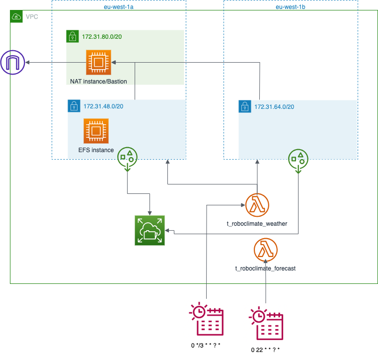

# Terraform configuration

## AWS architecture

Architecture created by the terraform configuration



- It creates two lambda functions ('weather' and 'forecast') and one EFS (Elastic File System)
- Access from lambda functions to EFS needs to go through an access point mounted in a private subnet; for redundancy, two private subnets, each in a different avaliability zone, are created
- In order to access the files generated by the lambda functions in the EFS, an EC2 instance with the EFS mounted on it is created in one of the private subnets.
- Said EC2 instance and the lambda functions need access to the internet, and for that, an EC2 NAT instance in a public subnet is required (the EC2 instance in the private subnet needs access to the internet to be provisioned)
- The NAT instance also plays the role of bastion as it allows access to the resources in the private subnets
- Lambda functions are executed according to the cron expression defined in the corresponding EventBridge schedulers


## Deploy process

### Create deployable artifact

Create a folder containing the source code and its dependencies by running

```sh
./artifact_prep.sh weather
./artifact_prep.sh forecast
```

### Run terraform script

The first time, run

```sh
terraform init
```

If not logged-in on Terraform Cloud yet, run

```sh
terraform login
```

Then execute the script

```sh
terraform apply -var-file ../secrets.tfvars
```

Note: before running the script, it may be necessary to update the value of the variable `my_ip` in `secrets.tfvars`


### CSV files

In case CSV files need to be uploaded/downloaded to/from EFS, it can be done by running

```sh
./upload_csv_files.sh
```
or
```sh
./download_csv_files.sh
```

Note: it may be necessary to add the private key to the ssh agent (`ssh-add <key_file>`)

Since the EC2 instance in the private subnet is only needed to upload/download csv files, it can be stopped for most of the time to save costs. The instance can be stopped and started with:

```sh
./efs_instance.sh stop
```
and
```sh
./efs_instance.sh start
```
respectively.

Logging into said instance can be done with:

```sh
./connefs.sh
```


### Provisioning EFS's EC2 instance 

In case it is necessary to trigger the execution of the `user_data` once the EC2 instance has been created, the instance must be replaced

```
terraform apply -var-file ../secrets.tfvars -replace aws_instance.efs_instance
```
